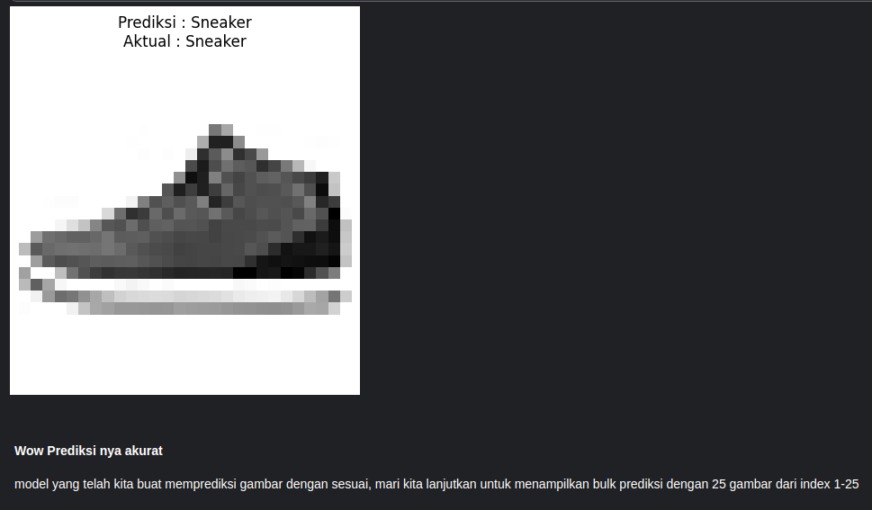
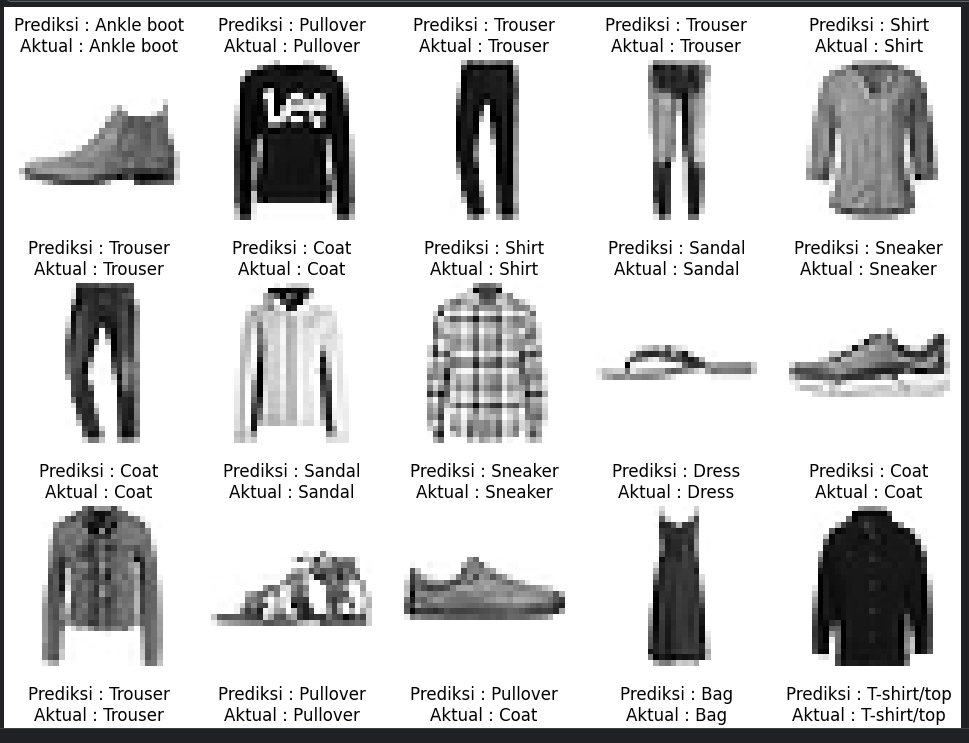

# PyTorch Learning

Welcome to the **PyTorch Learning** repository! 🎉

This repository is designed to provide comprehensive learning materials on PyTorch, starting from creating basic models like "Hello World" in PyTorch, to image classification, object detection, and exploring new aspects of PyTorch with various libraries. The primary goal of this repository is to help you understand and harness the power of PyTorch in various machine learning and computer vision applications.

## 📚 Available Learning Materials
- **Hello World**: Start with simple "Hello World" in PyTorch.
- **Create First Model With PyTorch**: Start with simple "First Model" models in PyTorch.
- **Image Classification**: Learn how to build image classification models using PyTorch.
- **Object Detection**: Explore object detection techniques and their implementation with PyTorch.
- **Advanced Explorations**: Dive into various advanced features and additional libraries to enhance your PyTorch skills.

## 🚀 My Goals
- Provide an in-depth understanding of PyTorch and its applications.
- Offer practical examples and projects for you to try on your own.
- Inspire further exploration in the field of machine learning and computer vision.

## 📂 Directory Structure
- `introduction/`: Examples and tutorials on creating basic models in PyTorch.
- `computer_vision/`: Examples and tutorials Computer Vision related.
- `nlp/`: Examples and tutorials Natural Language Processing related.

## Screenshots
Here are some screenshots from the repository:

### Image Classification Fashion MNIST (introduction/introduction-to-computer-vision.ipynb)

### Image Classification Fashion MNIST (introduction/introduction-to-computer-vision.ipynb)

